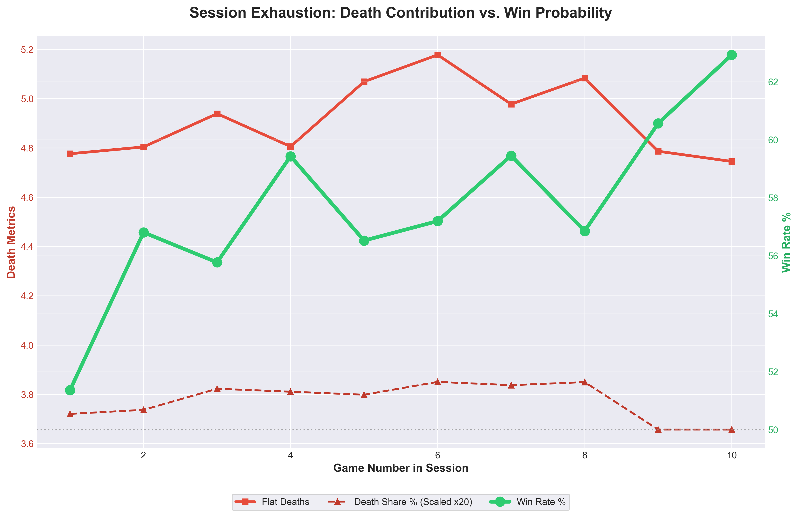
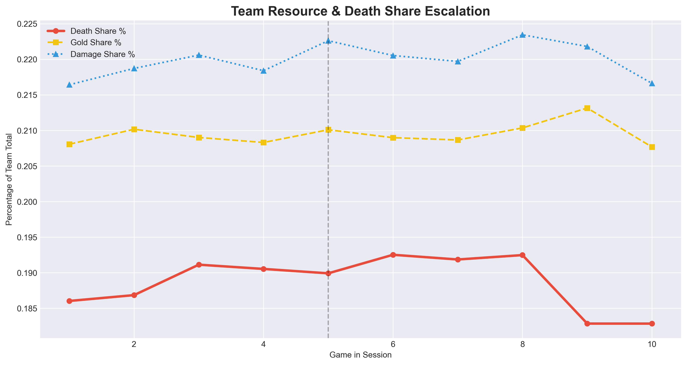
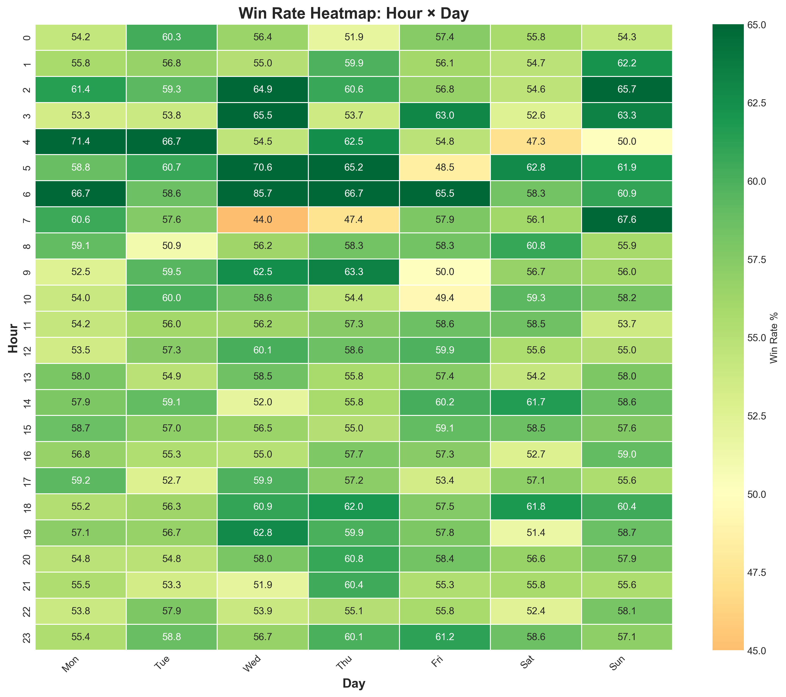
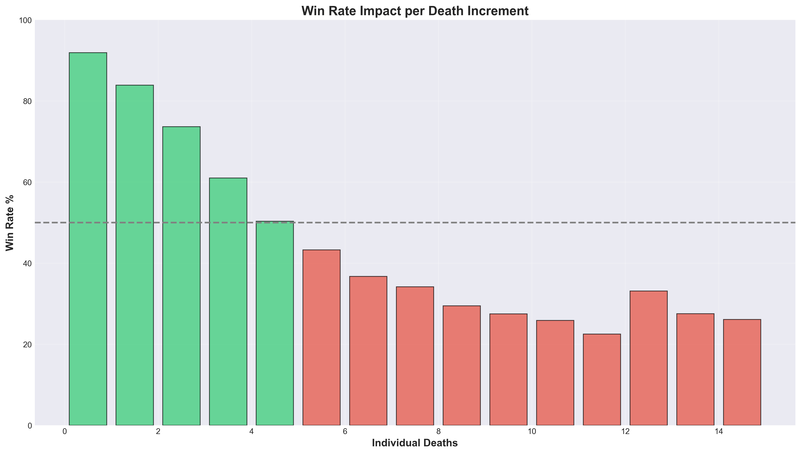

# Ranked Fatigue Analysis

A data pipeline analyzing how fatigue, tilt, and workload affect high-elo League of Legends performance. It pulls match data from the Riot API, calculates behavioral features (rest time, loss streaks, etc.), and tries to predict when a player is about to int.

## Why I built this
I was curious if you could actually measure "tilt" or "fatigue" in data. High-elo players play enough games that you can start to see patterns in session degradation and circadian rhythm effects.

Basically: Can we predict a performance drop *before* the game starts, based purely on how hard they've been grinding?

### Deaths climb across long sessions (p=0.0008)


## What it actually does
It ingests ~250 ranked matches per player (Challenger/GM EUW), calculates a bunch of fatigue features, and runs some ML models.

* **Fatigue Score:** A 0-1 score based on game density, lack of sleep, and loss streaks.
* **Performance Prediction:**
    * **Classification:** Predicts if deaths will spike >20% above baseline. (ROC-AUC ~0.59). It's not perfect, but it's better than random guessing without using in-game stats.
    * **Regression:** Predicts the magnitude of performance drop (R² 0.31).
* **Analysis:** Generates charts for session degradation, "revenge gaming" patterns, and hourly performance.

**Note on the model:** My first iteration hit 0.7 AUC but it was leaking game duration (longer games = more deaths). I removed that feature, which tanked the score to 0.59, but at least it's honest now.

## Setup

1.  **Environment**
    ```bash
    python -m venv venv
    source venv/bin/activate
    pip install -r requirements.txt
    ```

2.  **Config**
    * Create a local postgres DB.
    * `cp .env.example .env` and add your DB creds + Riot API key.

3.  **Run it**
    Initialize the DB:
    ```bash
    python scripts/init_database.py
    ```

    Then run the pipeline. I haven't made a Makefile yet, so just run these in order:
    ```bash
    python scripts/01_discover.py    # Finds players
    python scripts/02_ingest.py      # Downloads matches (Takes FOREVER, API limits are strict)
    python scripts/03_features.py    # Calculates fatigue stats
    python scripts/04_correlations.py
    python scripts/05_patterns.py
    python scripts/06_report.py      # Makes the charts
    python scripts/07_classify.py    # Train models
    ```

## Key Findings
* **Session degradation is real:** Deaths increase measurably after game 5 in a sitting (4.78 → 5.03, p=0.0008).
* **Late night penalty:** Playing 2-6 AM costs ~0.2 extra deaths per game vs. afternoon (p=0.009).
* **Fatigue predicts deaths in regression (p=0.001)**, but the effect is smaller than expected when isolated from game duration.
* **Counterintuitive:** Heavier workloads correlate with slightly *better* aggregate performance — likely survivorship bias (players quit losing sessions, keep going when winning).
* **Tilt didn't show up cleanly:** The behavioral tilt signal (requeue fast after losses) was not statistically significant in this dataset. Either it's not real at this elo, or the metric needs reworking.

* **Session degradation is real:** Deaths increase measurably after game 5...


* **Late night penalty:** Playing 2-6 AM costs ~0.2 extra deaths...


* **Why deaths matter** (context)


## Tech
* Python 3.10+ / PostgreSQL
* `scikit-learn` / `xgboost` for the models
* `pandas` / `sqlalchemy` for data wrangling
* `matplotlib` / `seaborn` for the viz

## License
MIT. Do whatever, just don't sell it.